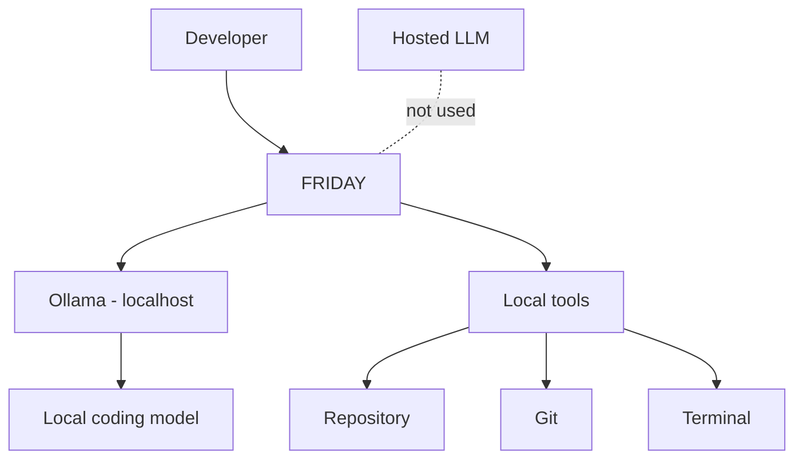
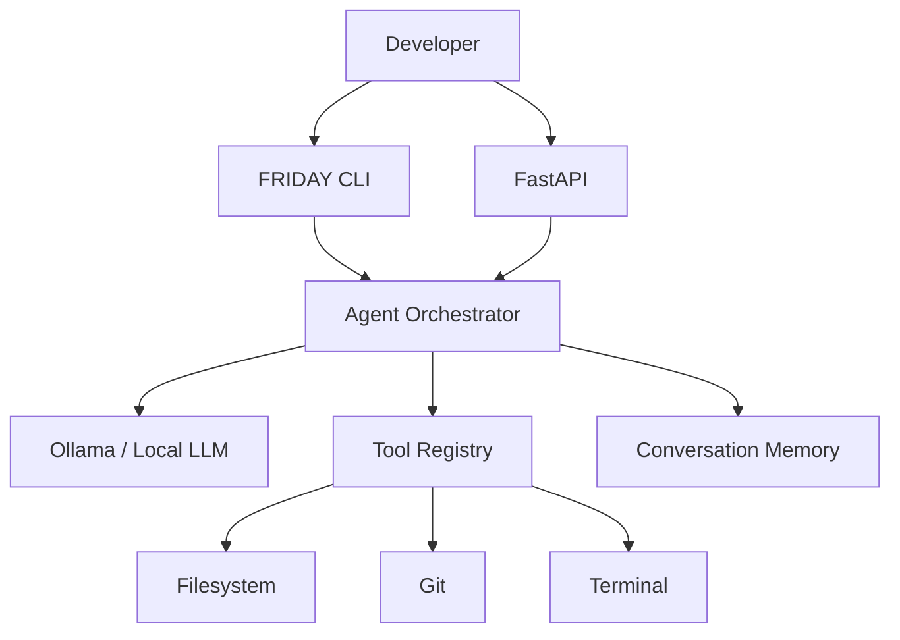

# PROJECT FRIDAY — V1

Private, PC-first AI engineering assistant.

## V1 privacy requirement

**Local inference only. No cloud LLM fallback.** FRIDAY talks to Ollama through its loopback API and rejects non-local Ollama endpoints and Ollama cloud-model names.



## Current V1 goal

FRIDAY can converse, inspect a repository, plan changes, read/search code, edit files, run development commands, inspect Git status/diff, and iterate after tool results.

## Setup

Requirements: Windows 10/11, Python 3.11+, Git, Ollama.

```powershell
py -3.11 -m venv .venv
.\.venv\Scripts\Activate.ps1
python -m pip install --upgrade pip
pip install -e .
```

Copy `.env.example` to `.env` and set `FRIDAY_WORKSPACE` to the repository FRIDAY is allowed to control. Do not point it at the whole `C:\` drive.

Install a local model. Good starting candidates are `qwen3-coder:30b` or `devstral:24b`, but the right choice depends on your machine.

```powershell
ollama pull qwen3-coder:30b
```

Check the local server:

```powershell
curl http://127.0.0.1:11434/api/tags
```

On Linux or WSL the equivalent setup is:

```bash
python3 -m venv .venv
source .venv/bin/activate
python -m pip install --upgrade pip
pip install -e ".[dev]"
```

Start FRIDAY:

```powershell
fastapi dev app/main.py
```

Or use the terminal interface:

```powershell
python -m app.cli
```

The CLI performs a local Ollama health/model check at startup.

## Approval gate

`write_file` and `run_shell` change the machine, so they run only after a human
approves that specific call. There is no request field, flag, or setting that
grants blanket autonomy, and an approval request that nobody answers expires as
a denial after `FRIDAY_APPROVAL_TIMEOUT_SECONDS`.

Every transport resolves the same pending request through one in-process broker.

**CLI** — prompts at the terminal and waits for `y`:

```text
[FRIDAY APPROVAL REQUIRED]
Tool: run_shell
{
  "command": "pytest -q"
}

Approve? [y/N]:
```

**WebSocket** (`/api/ws/chat`) — approval is requested and answered in-band, and
one agent lives for the connection so memory persists across turns:

```text
client -> {"message": "run the tests"}
server -> {"type": "approval_request", "id": "a1b2", "tool": "run_shell", "arguments": {...}}
client -> {"type": "approval_response", "id": "a1b2", "approved": true}
server -> {"type": "final", "response": "...", "tool_events": [...]}
```

**REST polling** — `POST /api/chat` holds the connection while a call waits.
Answer it from a second terminal:

```bash
curl -s localhost:8000/api/approvals
curl -s -X POST localhost:8000/api/approvals/a1b2 -d '{"approved": true}' -H 'content-type: application/json'
```

`POST /api/chat` is one-shot: it builds a fresh agent per request, so it keeps
no conversation memory. Use the WebSocket endpoint for a continuing session.

## Tests

```bash
pytest -q
```

The suite stubs the LLM, so it needs no Ollama server and no model. CI runs it
on Python 3.11 and 3.12 (`.github/workflows/ci.yml`).

## Architecture



## Development workflow

```text
You
  -> "Friday, inspect the authentication flow"
  -> FRIDAY searches/reads repository
  -> FRIDAY explains findings
  -> "Design the change"
  -> FRIDAY proposes plan
  -> "Start building"
  -> FRIDAY requests approval for writes/commands
  -> files change
  -> tests run
  -> git diff reviewed
  -> FRIDAY reports verified result
```

## Roadmap

- V1.0: text-first local coding agent
- V1.1: local speech-to-text + text-to-speech
- V1.2: wake word `Friday`
- V1.3: persistent project memory + pgvector
- V1.4: Home Assistant / room tools
- V2: Pepper's Ghost visual interface
