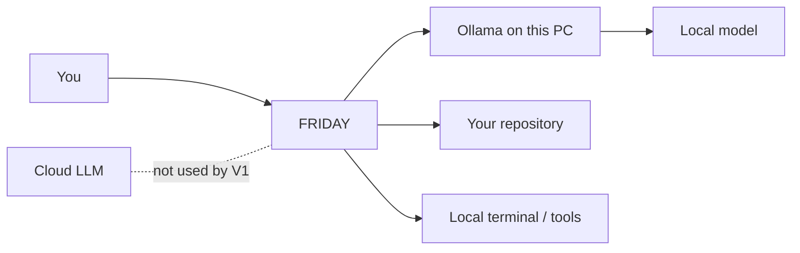

# FRIDAY Local AI Policy

## Goal

FRIDAY V1 is designed for private, local inference. During normal operation:



## Hard boundaries

1. `FRIDAY_OLLAMA_BASE_URL` must resolve to `localhost`, `127.0.0.1`, or `::1`.
2. Ollama model names containing `-cloud` are rejected.
3. FRIDAY does not contain an OpenAI, Anthropic, Gemini, or other remote LLM client.
4. The normal agent path has no cloud fallback.
5. Repository data stays in the local FRIDAY process and local Ollama process during inference.

## Important distinction

The **model download** is a network operation because the model must initially be obtained from a model registry. After the model is installed, FRIDAY's inference path targets the local Ollama server.

For maximum isolation after installation, you can run FRIDAY on a machine/network where outbound internet access is blocked. That should be tested operationally rather than assumed from application code alone.

## Model options

### Qwen3-Coder 30B

A strong starting point for an agentic coding workload. Ollama lists a 19 GB quantized package, 256K context, tool support, and local execution for the 30B version.

```powershell
ollama pull qwen3-coder:30b
ollama run qwen3-coder:30b
```

### Devstral 24B

Another coding-agent-oriented local model. Ollama lists a 14 GB package and 128K context and describes it as suitable for tool-driven software engineering workflows.

```powershell
ollama pull devstral:24b
ollama run devstral:24b
```

Which model is practical depends on your RAM/VRAM. We should select the model after checking your PC hardware rather than guessing.

## Sizing the model to the machine

Both models above assume a workstation. Check the hardware first:

```bash
free -h                 # usable RAM
nvidia-smi              # VRAM, if there is a GPU
```

A model needs roughly its download size in free memory, plus 1-2 GB for the
context window. Without a GPU, Ollama runs on the CPU, and throughput drops to
single-digit tokens per second — usable for short turns, painful for long ones.

| Free memory | Candidate | Approx. size | Notes |
| --- | --- | --- | --- |
| 20 GB+ or 24 GB VRAM | `qwen3-coder:30b` | ~19 GB | The README's default |
| 16 GB+ | `devstral:24b` | ~14 GB | Coding-agent oriented |
| 8-12 GB | `qwen2.5-coder:7b` | ~4.7 GB | Reliable tool calling |
| 4-6 GB | `qwen2.5-coder:3b` | ~1.9 GB | Weaker planning, still calls tools |

Sizes are approximate; confirm with `ollama list` after pulling.

FRIDAY's agent loop depends on tool calling, so any candidate must be a
tool-capable model. A model without tool support will answer in prose and never
invoke `read_file` or `run_shell`, which looks like FRIDAY ignoring the repo.

### Under WSL

WSL2 gets about half the host's RAM by default, so `free -h` inside WSL is the
number that matters. Raise it in `C:\Users\<you>\.wslconfig` and run
`wsl --shutdown`:

```ini
[wsl2]
memory=12GB
```

Ollama installed on the Windows host is not reachable at `127.0.0.1` from WSL
unless mirrored networking is on, and FRIDAY rejects non-loopback endpoints by
design. Either install Ollama inside WSL, or enable mirrored networking:

```ini
[wsl2]
networkingMode=mirrored
```
