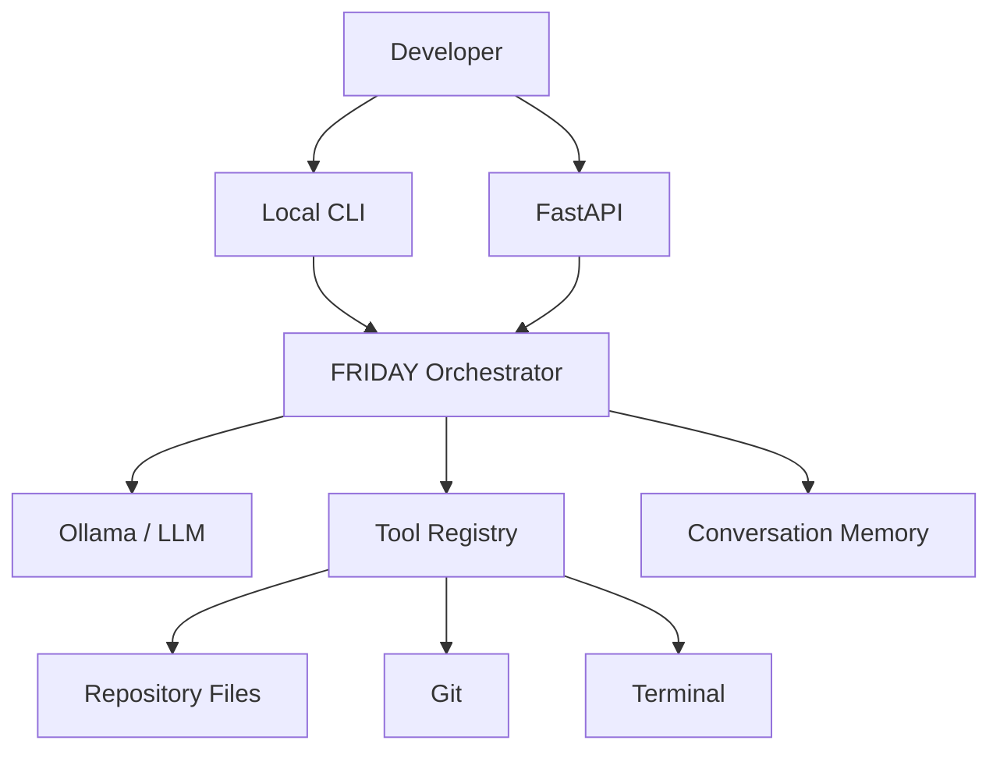
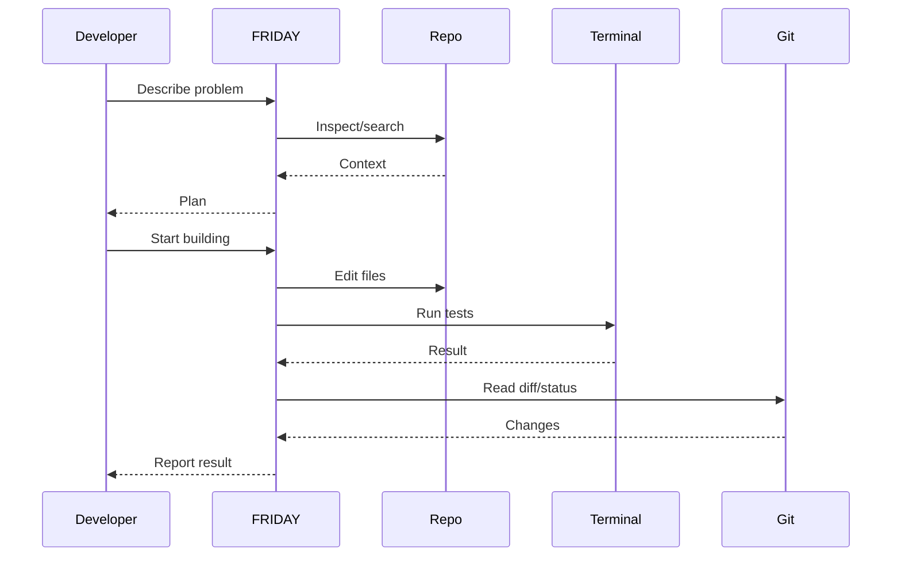

# FRIDAY V1 Architecture

```mermaid
flowchart TD
    DEV["Developer"] --> CLI["Local CLI"]
    DEV --> API["FastAPI"]
    CLI --> ORCH["FRIDAY Orchestrator"]
    API --> ORCH
    ORCH --> LLM["Ollama / LLM"]
    ORCH --> TOOLS["Tool Registry"]
    ORCH --> MEM["Conversation Memory"]
    TOOLS --> FILES["Repository Files"]
    TOOLS --> GIT["Git"]
    TOOLS --> TERM["Terminal"]
```

```mermaid
sequenceDiagram
    participant D as Developer
    participant F as FRIDAY
    participant R as Repo
    participant T as Terminal
    participant G as Git

    D->>F: Describe problem
    F->>R: Inspect/search
    R-->>F: Context
    F-->>D: Plan
    D->>F: Start building
    F->>R: Edit files
    F->>T: Run tests
    T-->>F: Result
    F->>G: Read diff/status
    G-->>F: Changes
    F-->>D: Report result
```
